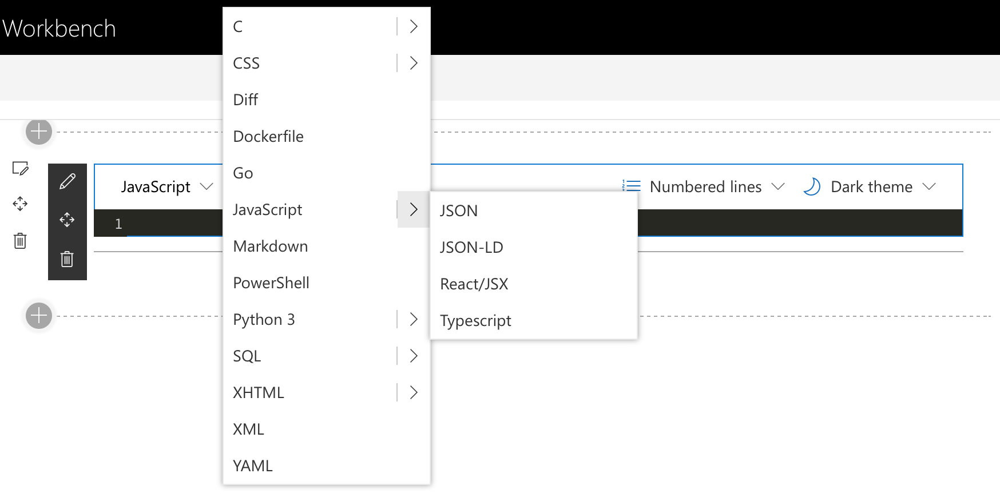

# Code Snippet ++

## Summary

This web part extends the available choice of coding languages in the original 'Code Snippet' webpart from Mircosoft.

It is designed to look just like the original so it is familiar, but has a lot more languages and the option to highlight matched brackets. 

If you want to extend or modify this code please feel free!

## Used SharePoint Framework Version

## Applies to

- [SharePoint Framework](https://aka.ms/spfx)
- [Microsoft 365 tenant](https://docs.microsoft.com/en-us/sharepoint/dev/spfx/set-up-your-developer-tenant)

> Get your own free development tenant by subscribing to [Microsoft 365 developer program](http://aka.ms/o365devprogram)

## Prerequisites

> Only tested with SharePoint Online

## Disclaimer

**THIS CODE IS PROVIDED *AS IS* WITHOUT WARRANTY OF ANY KIND, EITHER EXPRESS OR IMPLIED, INCLUDING ANY IMPLIED WARRANTIES OF FITNESS FOR A PARTICULAR PURPOSE, MERCHANTABILITY, OR NON-INFRINGEMENT.**

---

## Minimal Path to Awesome

- Clone this repo
- `npm install`
- `gulp bundle --ship`
- `gulp package-solution --ship`
- [Deploy the package](https://docs.microsoft.com/en-us/sharepoint/dev/spfx/web-parts/get-started/serve-your-web-part-in-a-sharepoint-page#deploy-the-helloworld-package-to-app-catalog) to the app catalog.
- [Install the client-side solution](https://docs.microsoft.com/en-us/sharepoint/dev/spfx/web-parts/get-started/serve-your-web-part-in-a-sharepoint-page#install-the-client-side-solution-on-your-site) to your SharePoint site.
- [Add web part to your SharePoint page](https://docs.microsoft.com/en-us/sharepoint/dev/spfx/web-parts/get-started/serve-your-web-part-in-a-sharepoint-page#add-the-helloworld-web-part-to-modern-page) named "Code Snippet ++".

## Features

Added languages include;

- Ceylon
- Cython
- Dockerfile
- JSON
- JSON-LD
- LESS
- Maria DB
- MS SQL
- MySQL
- PostgreSQL
- Python 2
- Python 3
- React/JSX
- Scala
- SCSS
- Squirrel
- XHTML
- XML
- YAML

Added functionality

- Match brackets, highlights bracket pairs within the code

With a little code modification, any language supported by [CodeMirror](https://codemirror.net) could be added. You could also add extra themes as well! 

## References

- [Getting started with SharePoint Framework](https://docs.microsoft.com/en-us/sharepoint/dev/spfx/set-up-your-developer-tenant)
- [Building for Microsoft teams](https://docs.microsoft.com/en-us/sharepoint/dev/spfx/build-for-teams-overview)
- [Use Microsoft Graph in your solution](https://docs.microsoft.com/en-us/sharepoint/dev/spfx/web-parts/get-started/using-microsoft-graph-apis)
- [Publish SharePoint Framework applications to the Marketplace](https://docs.microsoft.com/en-us/sharepoint/dev/spfx/publish-to-marketplace-overview)
- [Microsoft 365 Patterns and Practices](https://aka.ms/m365pnp) - Guidance, tooling, samples and open-source controls for your Microsoft 365 development
